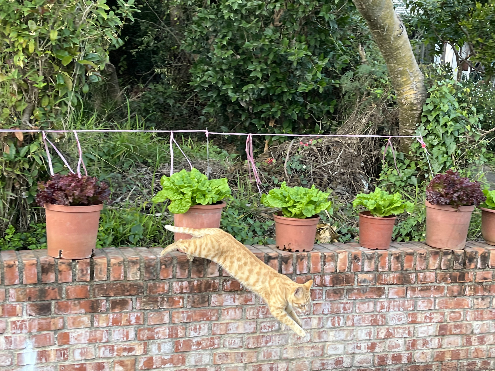

# Nunc Iaculis Arcu

## Maecenas at Tristique

Lorem ipsum dolor sit amet NixOS[@dolstra2008nixos] og
Pandoc[@dominici2014overview], consectetur adipiscing elit. Suspendisse
maximus arcu tellus, nec gravida felis dignissim sit amet. Phasellus
consectetur nec augue sed lacinia. Curabitur efficitur quam in
pellentesque facilisis. Nulla eget augue vitae nibh egestas pulvinar sed
quis sapien. Nunc iaculis arcu ac mi aliquet, congue pellentesque leo
ultricies. Phasellus finibus odio et luctus dignissim. Nam sed justo
maximus lectus dapibus porta egestas nec lacus. In convallis mollis
ipsum rutrum imperdiet[^sidenote]. Suspendisse ut mattis turpis. Suspendisse
mollis ultrices ex, sed accumsan justo dignissim non. Duis mattis velit
felis, suscipit facilisis mauris vulputate a. Sed euismod condimentum
lorem, eget interdum nibh lobortis id.

[^sidenote]: This is the text in the side note. It is smaller and only supports inline elements, like **bold** or [links](#), but not lists or code blocks.

Integer gravida gravida ex nec faucibus.

``` {.bash .numberLines .hl-7 .hl-10}
git clone https://github.com/jez/pandoc-markdown-css-theme
cd pandoc-markdown-css-theme

# Test everything by forcing a clean build
# (the generated comes with the clone)
make clean
make

# If you installed watchman
make watch
```

Phasellus aliquam consequat odio vel sagittis. Suspendisse potenti.
Maecenas at tristique enim. Praesent posuere quam est, vitae sagittis
mauris semper non. Cras non nisl id neque tempus dapibus. Nunc
consectetur tristique pulvinar. Sed aliquam turpis ut ex imperdiet
mollis. Etiam vitae urna neque. Sed ultrices tempus orci efficitur
mollis.

## Cras Nisi Elit

{#fig:kottur width="60%"}

Fusce lobortis sodales dui, eu aliquet purus pulvinar atfig. 1. Aliquam
pellentesque dapibus mollis. Pellentesque felis urna, feugiat eu varius
at, lobortis ac nulla. Fusce justo quam, laoreet eget semper id,
molestie ac nulla. Vivamus varius auctor pharetra. Integer consequat
sollicitudin erat, non dictum nunc tincidunt porta. Vestibulum nec
suscipit sapien. Mauris est sapien, pretium id diam vitae, dictum semper
risus.

$$IG_{X, A}{(X,a)} = D_\text{KL}{\left(P_X{(x|a)} \| P_X{(x|I)}\right)}$$

Proin mauris tortor, bibendum vel cursus at, scelerisque et purus. Cras
nisi elit, pretium eget bibendum imperdiet, mattis ut est. Vestibulum
ante ipsum primis in faucibus orci luctus et ultrices posuere cubilia
curae; Proin faucibus nisl erat, a ornare eros eleifend ac. Ut mi justo,
rutrum nec viverra et, interdum at neque. Fusce accumsan vulputate urna
vitae facilisis. Ut vel gravida dui.

- Fusce
- Obortis sodales
- Aliquam pellentesque
  1. Vitae facilisis purus
  2. Proin faucibus

Phasellus vestibulum ullamcorper tristique. Nullam ut lacinia metus.
Donec porttitor massa nunc, vitae vehicula felis varius gravida.
Interdum et malesuada fames ac ante ipsum primis in faucibus. Vivamus
sagittis neque non orci varius suscipit. Maecenas pretium quis tortor
eget ullamcorper. Nulla maximus iaculis nisl at maximus. Nulla malesuada
sem enim, at dictum diam pulvinar non. Mauris rutrum, odio sed rutrum
aliquam, lectus tortor vestibulum lacus, vel blandit augue felis vel mi.
Nulla ut ipsum volutpat, tempor quam sed, eleifend metus. Nunc euismod
massa quis erat euismod, non aliquam ligula posuere. Vestibulum pulvinar
metus a condimentum fringilla.

# Bibliography

<!-- vim: set ft=markdown.pandoc: -->
